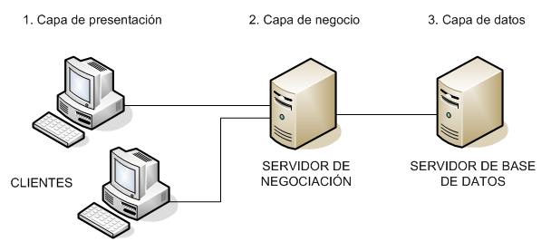
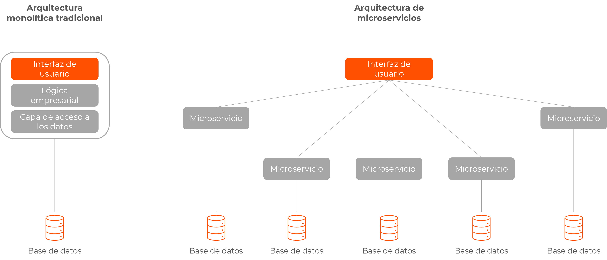
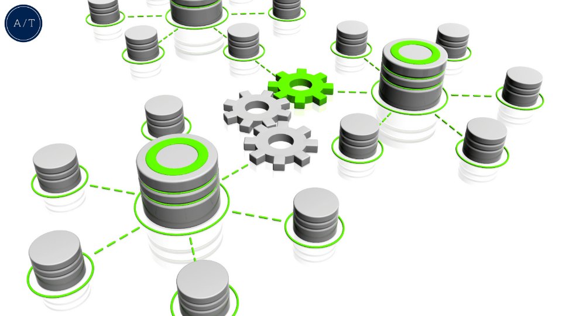
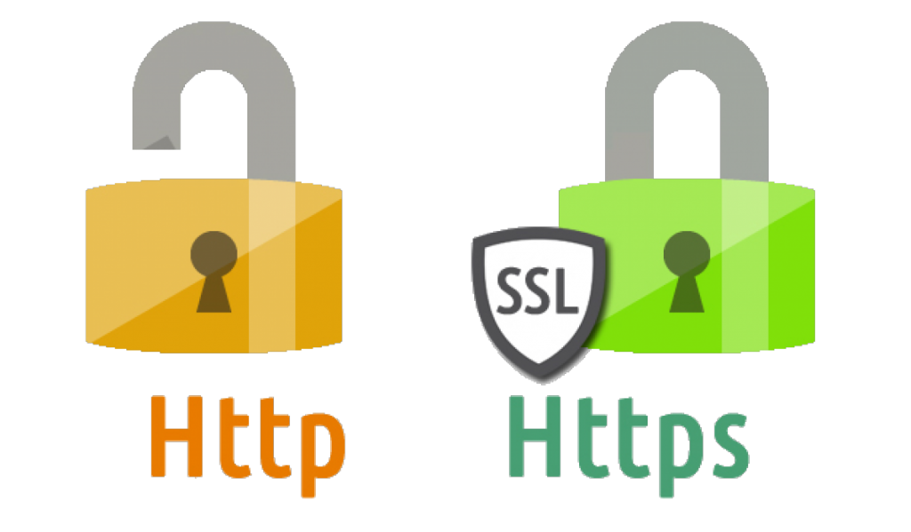
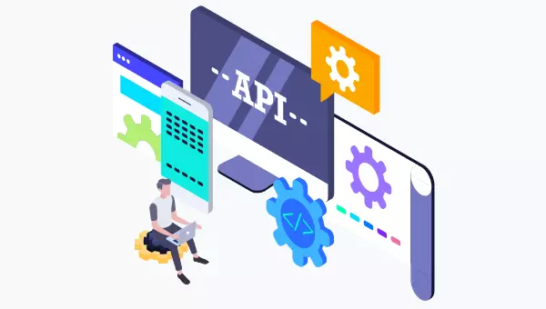
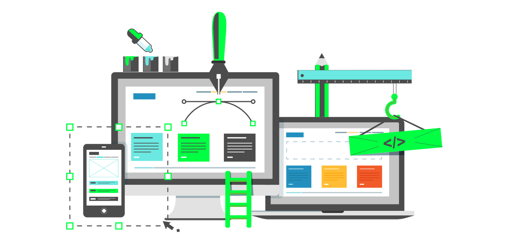

# U1: Arquitecturas y Tecnologías en la Programación Web

## Índice

1. [Introducción a la Programación Web](#introducción-a-la-programación-web)
2. [Arquitecturas de Aplicaciones Web](#arquitecturas-de-aplicaciones-web)
   - [2.1 Arquitectura Cliente-Servidor](#21-arquitectura-cliente-servidor)
   - [2.2 Arquitectura de Tres Capas](#22-arquitectura-de-tres-capas)
   - [2.3 Arquitectura de Microservicios](#23-arquitectura-de-microservicios)
3. [Tecnologías del Lado del Servidor](#tecnologías-del-lado-del-servidor)
   - [3.1 Lenguajes de Programación](#31-lenguajes-de-programación)
   - [3.2 Frameworks Web](#32-frameworks-web)
   - [3.3 Bases de Datos](#33-bases-de-datos)
4. [Protocolos y Comunicación en la Web](#protocolos-y-comunicación-en-la-web)
   - [4.1 HTTP y HTTPS](#41-http-y-https)
   - [4.2 APIs RESTful](#42-apis-restful)
5. [Tendencias Actuales en la Programación Web](#tendencias-actuales-en-la-programación-web)
6. [Ejercicios](#ejercicios)

---

## Introducción a la Programación Web

La **programación web** consiste en el desarrollo de aplicaciones y servicios que se ejecutan en un entorno web utilizando navegadores como interfaz de usuario. Combina tecnologías del lado del cliente y del servidor para crear experiencias interactivas y dinámicas.

---

## Arquitecturas de Aplicaciones Web

La arquitectura de una aplicación web define su estructura y cómo sus componentes interactúan entre sí. A continuación, se describen las arquitecturas más comunes.

### 2.1 Arquitectura Cliente-Servidor

En esta arquitectura, el **cliente** (generalmente un navegador web) solicita recursos o servicios al **servidor**, que procesa la solicitud y devuelve una respuesta.

**Características:**

- Separación clara entre cliente y servidor.
- El cliente es responsable de la interfaz de usuario.
- El servidor gestiona la lógica de negocio y el acceso a datos.

### 2.2 Arquitectura de Tres Capas

Divide la aplicación en tres capas lógicas que separan responsabilidades.

1. **Capa de Presentación:** Interfaz de usuario y experiencia del usuario.
2. **Capa de Lógica de Negocio:** Procesamiento de datos y reglas de negocio.
3. **Capa de Datos:** Gestión de bases de datos y almacenamiento de información.

**Ventajas:**

- Mantenimiento más sencillo.
- Escalabilidad mejorada.
- Reutilización de código.

### 2.3 Arquitectura de Microservicios

Consiste en desarrollar la aplicación como un conjunto de **servicios pequeños e independientes** que se comunican entre sí.

**Beneficios:**

- Despliegue y desarrollo independientes.
- Escalabilidad selectiva.
- Mayor tolerancia a fallos.

---

## Tecnologías del Lado del Servidor

### 3.1 Lenguajes de Programación

- **Java:** Orientado a objetos, robusto y multiplataforma. Usado en aplicaciones empresariales y sistemas de gran escala.
- **Python:** Sencillo y legible, con una sintaxis clara. Popular en ciencia de datos y desarrollo web con frameworks como Django y Flask.
- **PHP:** Amplio soporte en la web, utilizado en sistemas de gestión de contenido como WordPress y frameworks como Laravel.
- **JavaScript (Node.js):** Permite ejecutar JavaScript en el servidor, unificando el lenguaje en frontend y backend, ideal para aplicaciones en tiempo real.

### 3.2 Frameworks Web

Los **frameworks web** proporcionan una estructura estándar para desarrollar aplicaciones web, facilitando tareas comunes y permitiendo enfocarse en la lógica de negocio.

#### **Spring Boot (Java)**

Spring Boot es un framework que simplifica la creación de aplicaciones Java basadas en Spring, facilitando la configuración y el despliegue.

- **Características:**
  - **Configuración Automática:** Detecta las dependencias y configura automáticamente los componentes necesarios.
  - **Servidor Embebido:** Incluye servidores como Tomcat o Jetty, evitando configuraciones adicionales.
  - **Ecosistema Amplio:** Integración con proyectos Spring como Spring Data y Spring Security.
  - **Ideal para Microservicios:** Soporta fácilmente la creación de microservicios independientes.

#### **Django (Python)**

Django es un framework de alto nivel que promueve el desarrollo rápido y el diseño limpio, siguiendo el principio de "No te repitas" (DRY).

- **Características:**
  - **ORM Potente:** Simplifica la interacción con bases de datos mediante objetos Python.
  - **Panel de Administración Integrado:** Genera automáticamente una interfaz administrativa para gestionar datos.
  - **Seguridad Incorporada:** Protege contra ataques comunes como inyección SQL y cross-site scripting.
  - **Escalabilidad y Versatilidad:** Adecuado para proyectos pequeños y grandes aplicaciones.

#### **Express.js (Node.js)**

Express.js es un framework minimalista para Node.js que facilita la creación de aplicaciones web y APIs robustas.

- **Características:**
  - **Simplicidad y Flexibilidad:** Permite estructurar aplicaciones de manera personalizada.
  - **Middleware Modular:** Extiende la funcionalidad mediante componentes reutilizables.
  - **Gran Comunidad:** Amplio conjunto de paquetes y recursos disponibles.
  - **Adecuado para Aplicaciones en Tiempo Real:** Ideal para aplicaciones que requieren comunicación bidireccional.

#### **Laravel (PHP)**

Laravel es un framework web moderno para PHP que sigue el patrón MVC y proporciona una sintaxis elegante y expresiva.

- **Características:**
  - **Enrutamiento Avanzado:** Gestión de rutas sencilla y potente.
  - **Eloquent ORM:** Interactúa con bases de datos de forma intuitiva mediante modelos.
  - **Motor de Plantillas Blade:** Crea vistas con sintaxis limpia y heredable.
  - **Herramientas Integradas:** Sistemas de cola, eventos y tareas programadas.

### 3.3 Bases de Datos

#### Relacionales (SQL)

- **MySQL:** Sistema de gestión de bases de datos relacional de código abierto, ampliamente utilizado en aplicaciones web.
- **PostgreSQL:** Base de datos relacional avanzada con extensiones como soporte para JSON y XML.
- **Oracle:** Base de datos comercial robusta con características avanzadas para grandes volúmenes de datos.

**Características:**

- **Modelo Relacional:** Datos organizados en tablas con relaciones definidas.
- **Integridad de Datos:** Uso de claves primarias y foráneas.
- **Transacciones ACID:** Garantiza la consistencia de las operaciones.

#### NoSQL

- **MongoDB:** Base de datos orientada a documentos, almacena datos en formato BSON (similar a JSON).
- **Cassandra:** Diseñada para manejar grandes cantidades de datos en múltiples servidores, altamente escalable.
- **Redis:** Almacén de datos en memoria, utilizado para almacenamiento en caché y sistemas en tiempo real.

**Características:**

- **Flexibilidad en el Modelo de Datos:** Permite almacenar datos no estructurados o semi-estructurados.
- **Alto Rendimiento y Escalabilidad:** Adecuado para aplicaciones que requieren respuestas rápidas.
- **Variedad de Tipos de Almacenamiento:** Documentos, pares clave-valor, grafos, entre otros.

---

## Protocolos y Comunicación en la Web

### 4.1 HTTP y HTTPS

#### HTTP (HyperText Transfer Protocol)

Es el protocolo base de la web que define cómo se formatean y transmiten los mensajes entre cliente y servidor.

- **Puerto predeterminado:** 80
- **Comunicación en texto plano:** No cifrada.

#### HTTPS (HTTP Secure)

Es la versión segura de HTTP que utiliza SSL/TLS para cifrar la comunicación.

- **Puerto predeterminado:** 443
- **Comunicación cifrada:** Protege la integridad y confidencialidad de los datos.

**Métodos HTTP Comunes:**

- **GET:** Solicita representación de un recurso.
- **POST:** Envía datos al servidor.
- **PUT:** Actualiza un recurso existente.
- **DELETE:** Elimina un recurso.

### 4.2 APIs RESTful

Las **APIs RESTful** son interfaces que siguen el estilo arquitectónico REST (Representational State Transfer) para la comunicación entre sistemas.

**Principios de REST:**

- **Cliente-Servidor:** Separación de responsabilidades.
- **Sin Estado:** Cada solicitud es independiente.
- **Cacheable:** Las respuestas pueden ser almacenadas en caché.
- **Interfaz Uniforme:** Uso de métodos HTTP estándar.

---

## Tendencias Actuales en la Programación Web

- **Aplicaciones de Una Sola Página (SPA):** Uso de frameworks como React, Angular o Vue.js para experiencias más fluidas.
- **Computación Serverless:** Ejecución de código sin necesidad de gestionar servidores físicos.
- **DevOps y CI/CD:** Integración y entrega continua para mejorar la eficiencia del desarrollo.
- **Inteligencia Artificial y Aprendizaje Automático:** Integración en aplicaciones web para ofrecer experiencias personalizadas.

---

## Ejercicios

1. **Investigación Individual:**

   - Selecciona un sitio web que utilices frecuentemente.
   - Identifica qué arquitectura crees que utiliza (cliente-servidor, tres capas, microservicios).
   - Justifica tu respuesta basándote en las características estudiadas.

2. **Comparativa de Tecnologías:**

   - Elabora una tabla comparativa de tres lenguajes de programación del lado del servidor.
   - Incluye aspectos como sintaxis, frameworks disponibles, casos de uso y curva de aprendizaje.

3. **Práctica con Herramientas:**

   - Utiliza **Postman** o **cURL** para realizar solicitudes HTTP a una API pública, como [JSONPlaceholder](https://jsonplaceholder.typicode.com/).
   - Realiza solicitudes GET y POST, y analiza las respuestas obtenidas.

4. **Análisis de una API RESTful:**

   - Escoge una API pública (por ejemplo, [GitHub API](https://docs.github.com/en/rest)).
   - Describe cómo implementa los principios de REST.
   - Identifica los recursos disponibles y los métodos HTTP soportados.

---
