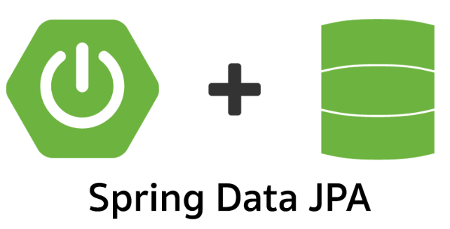

# UD4: Gestión de Datos con Spring Data JPA

## Índice

- [Introducción a Spring Data JPA](#introducción-a-spring-data-jpa)
- [Configuración de Spring Data JPA en un Proyecto Spring Boot](#configuración-de-spring-data-jpa-en-un-proyecto-spring-boot)
- [Definición de Entidades](#definición-de-entidades)
  - [Anotaciones Básicas](#anotaciones-básicas)
  - [Estrategias de Generación de IDs](#estrategias-de-generación-de-ids)
- [Repositorios en Spring Data JPA](#repositorios-en-spring-data-jpa)
- [Operaciones CRUD Básicas](#operaciones-crud-básicas)
  - [Equivalencia entre SQL y JPA](#equivalencia-entre-sql-y-jpa)
- [Consultas Personalizadas](#consultas-personalizadas)
- [Relaciones entre Entidades](#relaciones-entre-entidades)
  - [Tipos de Relaciones](#tipos-de-relaciones)
  - [Ejemplo Completo de Relaciones](#ejemplo-completo-de-relaciones)
- [Gestión de Transacciones](#gestión-de-transacciones)
  - [Importancia de las Transacciones](#importancia-de-las-transacciones)
  - [Uso de `@Transactional`](#uso-de-transactional)
- [Lanzamiento de Excepciones](#lanzamiento-de-excepciones)
- [Ejemplo Práctico Ampliado](#ejemplo-práctico-ampliado)
- [Ejercicios Propuestos](#ejercicios-propuestos)
- [Conclusión](#conclusión)

---

## Introducción a Spring Data JPA

Spring Data JPA es un módulo de Spring que simplifica el acceso y gestión de datos en aplicaciones Java. Proporciona una capa de abstracción sobre JPA (Java Persistence API), facilitando la interacción con bases de datos relacionales sin necesidad de escribir código repetitivo.

### ¿Qué es JPA?

JPA es una especificación de Java que define cómo manejar datos relacionales en aplicaciones Java utilizando objetos. Permite mapear clases Java a tablas de bases de datos, facilitando las operaciones de persistencia.

### Ventajas de usar Spring Data JPA

- **Simplicidad**: Reduce la cantidad de código necesario para realizar operaciones comunes.
- **Productividad**: Proporciona métodos predefinidos para operaciones CRUD.
- **Extensibilidad**: Permite crear consultas personalizadas fácilmente.
- **Integración**: Se integra perfectamente con otros módulos de Spring.



---

## Configuración de Spring Data JPA en un Proyecto Spring Boot

### Dependencias

Para utilizar Spring Data JPA, es necesario incluir las siguientes dependencias en el archivo `pom.xml`:

```xml
<dependencies>
    <!-- Dependencia de Spring Data JPA -->
    <dependency>
        <groupId>org.springframework.boot</groupId>
        <artifactId>spring-boot-starter-data-jpa</artifactId>
    </dependency>

    <!-- Controlador de la base de datos (por ejemplo, H2 o MySQL) -->
    <!-- Usando H2 en este ejemplo -->
    <dependency>
        <groupId>com.h2database</groupId>
        <artifactId>h2</artifactId>
        <scope>runtime</scope>
    </dependency>
</dependencies>
```

### Configuración de la Base de Datos

En el archivo `application.properties` o `application.yml`, configura la conexión a la base de datos:

```properties
# Usando H2 en memoria
spring.datasource.url=jdbc:h2:mem:testdb
spring.datasource.driverClassName=org.h2.Driver
spring.datasource.username=sa
spring.datasource.password=

# Mostrar sentencias SQL en la consola
spring.jpa.show-sql=true
spring.jpa.properties.hibernate.format_sql=true

# Generar las tablas automáticamente
spring.jpa.hibernate.ddl-auto=update
```

---

## Definición de Entidades

Las entidades representan tablas en la base de datos. Se definen como clases Java anotadas con `@Entity`.

### Anotaciones Básicas

- `@Entity`: Indica que la clase es una entidad.
- `@Table`: Especifica el nombre de la tabla (opcional).
- `@Id`: Define la clave primaria.
- `@GeneratedValue`: Especifica la estrategia de generación de la clave primaria.
- `@Column`: Configura propiedades de la columna (opcional).

### Estrategias de Generación de IDs

La anotación `@GeneratedValue` se utiliza para indicar que el valor del ID se generará automáticamente. Existen diferentes estrategias que puedes especificar con el atributo `strategy`:

- `GenerationType.AUTO`: La estrategia es elegida por el proveedor de persistencia.
- `GenerationType.IDENTITY`: Utiliza una columna de auto-incremento en la base de datos.
- `GenerationType.SEQUENCE`: Usa una secuencia de la base de datos (requiere definir una secuencia).
- `GenerationType.TABLE`: Utiliza una tabla específica para generar los IDs (menos común).

**Ejemplo:**

```java
@Id
@GeneratedValue(strategy = GenerationType.IDENTITY)
private Long id;
```

### Ejemplo de una Entidad Simple

```java
import javax.persistence.*;

@Entity
@Table(name = "usuarios")
public class Usuario {

    @Id
    @GeneratedValue(strategy = GenerationType.IDENTITY)
    private Long id;

    @Column(name = "nombre", nullable = false)
    private String nombre;

    private String email;

    // Getters y Setters
}
```

---

## Repositorios en Spring Data JPA

Los repositorios son interfaces que permiten realizar operaciones sobre las entidades.

### Interfaces Principales

- `CrudRepository<T, ID>`: Proporciona métodos CRUD básicos.
- `JpaRepository<T, ID>`: Extiende `CrudRepository` y añade métodos adicionales.

### Creación de un Repositorio

```java
import org.springframework.data.jpa.repository.JpaRepository;

public interface UsuarioRepository extends JpaRepository<Usuario, Long> {
    // Métodos personalizados si es necesario
}
```

---

## Operaciones CRUD Básicas

### Equivalencia entre SQL y JPA

| Operación     | SQL               | JPA Repository                        |
|---------------|-------------------|---------------------------------------|
| **Crear**     | `INSERT INTO`     | `save(entity)`                        |
| **Leer**      | `SELECT`          | `findById(id)`, `findAll()`           |
| **Actualizar**| `UPDATE`          | `save(entity)` (si ya existe)         |
| **Eliminar**  | `DELETE`          | `delete(entity)`, `deleteById(id)`    |

### Guardar una Entidad

```java
@Autowired
private UsuarioRepository usuarioRepository;

public void crearUsuario() {
    Usuario usuario = new Usuario();
    usuario.setNombre("Juan");
    usuario.setEmail("juan@example.com");
    usuarioRepository.save(usuario);
}
```

### Obtener una Entidad

```java
public void obtenerUsuario(Long id) {
    Optional<Usuario> usuario = usuarioRepository.findById(id);
    usuario.ifPresent(u -> System.out.println(u.getNombre()));
}
```

### Actualizar una Entidad

```java
public void actualizarUsuario(Long id) {
    Usuario usuario = usuarioRepository.findById(id).orElseThrow(() -> new ResourceNotFoundException("Usuario no encontrado"));
    usuario.setEmail("nuevoemail@example.com");
    usuarioRepository.save(usuario);
}
```

### Eliminar una Entidad

```java
public void eliminarUsuario(Long id) {
    usuarioRepository.deleteById(id);
}
```

---

## Consultas Personalizadas

Aunque Spring Data JPA proporciona métodos CRUD básicos, a veces necesitas realizar consultas más complejas.

### Métodos Derivados

Puedes crear métodos en el repositorio siguiendo una convención de nombres. Spring Data JPA genera la implementación automáticamente.

```java
List<Usuario> findByNombre(String nombre);
List<Usuario> findByNombreAndEmail(String nombre, String email);
List<Usuario> findByNombreContaining(String fragmentoNombre);
```

### Uso de la Anotación `@Query`

Puedes utilizar la anotación `@Query` para definir consultas personalizadas utilizando JPQL (Java Persistence Query Language).

```java
@Query("SELECT u FROM Usuario u WHERE u.email = ?1")
Usuario buscarPorEmail(String email);
```

### Consultas Nativas

Si necesitas ejecutar una consulta SQL nativa, puedes hacerlo:

```java
@Query(value = "SELECT * FROM usuarios WHERE email = ?1", nativeQuery = true)
Usuario buscarPorEmailNativo(String email);
```

---

## Relaciones entre Entidades

Las entidades en JPA pueden tener relaciones entre sí. Es importante mapear estas relaciones correctamente para reflejar las asociaciones en la base de datos.

### Tipos de Relaciones

1. **One-to-One (Uno a Uno):** Un registro de una tabla se asocia con un único registro de otra tabla.
2. **One-to-Many (Uno a Muchos) y Many-to-One (Muchos a Uno):** Un registro de una tabla se asocia con múltiples registros de otra tabla, y viceversa.
3. **Many-to-Many (Muchos a Muchos):** Múltiples registros de una tabla se asocian con múltiples registros de otra tabla.

### Ejemplo Completo de Relaciones

Supongamos que estamos modelando una aplicación de comercio electrónico con las siguientes entidades:

- **Usuario**
- **Pedido**
- **Producto**

#### Definición de Entidades y Relaciones

##### Entidad Usuario

```java
import javax.persistence.*;
import java.util.List;

@Entity
public class Usuario {

    @Id
    @GeneratedValue(strategy = GenerationType.IDENTITY)
    private Long id;

    private String nombre;

    @OneToMany(mappedBy = "usuario", cascade = CascadeType.ALL)
    private List<Pedido> pedidos;

    // Getters y Setters
}
```

##### Entidad Pedido

```java
import javax.persistence.*;
import java.util.List;

@Entity
public class Pedido {

    @Id
    @GeneratedValue(strategy = GenerationType.IDENTITY)
    private Long id;

    private String fecha;

    @ManyToOne
    @JoinColumn(name = "usuario_id")
    private Usuario usuario;

    @ManyToMany
    @JoinTable(
        name = "pedido_producto",
        joinColumns = @JoinColumn(name = "pedido_id"),
        inverseJoinColumns = @JoinColumn(name = "producto_id")
    )
    private List<Producto> productos;

    // Getters y Setters
}
```

##### Entidad Producto

```java
import javax.persistence.*;
import java.util.List;

@Entity
public class Producto {

    @Id
    @GeneratedValue(strategy = GenerationType.IDENTITY)
    private Long id;

    private String nombre;
    private Double precio;

    @ManyToMany(mappedBy = "productos")
    private List<Pedido> pedidos;

    // Getters y Setters
}
```

---

## Gestión de Transacciones

Las transacciones garantizan la integridad y consistencia de los datos en operaciones que involucran múltiples cambios en la base de datos.

### Importancia de las Transacciones

- **Atomicidad:** Asegura que todas las operaciones dentro de una transacción se completen correctamente o ninguna lo hace.
- **Consistencia:** Mantiene la base de datos en un estado consistente antes y después de la transacción.
- **Aislamiento:** Las transacciones concurrentes no interfieren entre sí.
- **Durabilidad:** Una vez que una transacción se compromete, sus cambios persisten incluso en caso de fallos.

### Uso de `@Transactional`

En Spring, puedes gestionar transacciones mediante la anotación `@Transactional`.

#### Ejemplo:

```java
import org.springframework.stereotype.Service;
import org.springframework.transaction.annotation.Transactional;

@Service
public class PedidoService {

    @Autowired
    private PedidoRepository pedidoRepository;

    @Autowired
    private ProductoRepository productoRepository;

    @Transactional
    public void procesarPedido(Pedido pedido) {
        // Operaciones que forman parte de la transacción
        pedidoRepository.save(pedido);
        actualizarStock(pedido.getProductos());
    }

    private void actualizarStock(List<Producto> productos) {
        for (Producto producto : productos) {
            producto.setStock(producto.getStock() - 1);
            productoRepository.save(producto);
        }
    }
}
```

---

## Lanzamiento de Excepciones

Cuando realizamos operaciones de actualización sobre una entidad, es posible que el objeto que intentamos modificar no exista en la base de datos. En estos casos, podemos lanzar una excepción personalizada, como `ResourceNotFoundException`.

#### Ejemplo:

```java
public void actualizarUsuario(Long id, Usuario nuevosDatos) {
    Usuario usuario = usuarioRepository.findById(id).orElseThrow(() -> new ResourceNotFoundException("Usuario no encontrado"));
    usuario.setNombre(nuevosDatos.getNombre());
    usuario.setEmail(nuevosDatos.getEmail());
    usuarioRepository.save(usuario);
}
```

En este caso, si el usuario con el ID proporcionado no existe, se lanza una `ResourceNotFoundException` con un mensaje explicativo.

---

## Ejemplo Práctico Ampliado

Desarrollaremos una aplicación para gestionar una biblioteca, con las siguientes entidades:
- **Libro**
- **Autor**
- **Editorial**

### Entidades y Relaciones

#### Entidad Autor

```java
import javax.persistence.*;
import java.util.List;

@Entity
public class Autor {

    @Id
    @GeneratedValue(strategy = GenerationType.IDENTITY)
    private Long id;

    private String nombre;

    @ManyToMany(mappedBy = "autores")
    private List<Libro> libros;

    // Getters y Setters
}
```

#### Entidad Editorial

```java
import javax.persistence.*;
import java.util.List;

@Entity
public class Editorial {

    @Id
    @GeneratedValue(strategy = GenerationType.IDENTITY)
    private Long id;

    private String nombre;

    @OneToMany(mappedBy = "editorial")
    private List<Libro> libros;

    // Getters y Setters
}
```

#### Entidad Libro

```java
import javax.persistence.*;
import java.util.List;

@Entity
public class Libro {

    @Id
    @GeneratedValue(strategy = GenerationType.IDENTITY)
    private Long id;

    private String titulo;

    @ManyToMany
    @JoinTable(
        name = "libro_autor",
        joinColumns = @JoinColumn(name = "libro_id"),
        inverseJoinColumns = @JoinColumn(name = "autor_id")
    )
    private List<Autor> autores;

    @ManyToOne
    @JoinColumn(name = "editorial_id")
    private Editorial editorial;

    // Getters y Setters
}
```

### Repositorios

```java
public interface LibroRepository extends JpaRepository<Libro, Long> {
    List<Libro> findByTituloContaining(String titulo);
}

public interface AutorRepository extends JpaRepository<Autor, Long> {
}

public interface EditorialRepository extends JpaRepository<Editorial, Long> {
}
```

### Servicio con Transacciones y Consultas Personalizadas

```java
import org.springframework.stereotype.Service;
import org.springframework.transaction.annotation.Transactional;

@Service
public class BibliotecaService {

    @Autowired
    private LibroRepository libroRepository;

    @Autowired
    private AutorRepository autorRepository;

    @Autowired
    private EditorialRepository editorialRepository;

    @Transactional
    public void agregarNuevoLibro(Libro libro, List<Autor> autores, Editorial editorial) {
        // Guardar o actualizar la editorial
        editorialRepository.save(editorial);
        libro.setEditorial(editorial);

        // Guardar o actualizar los autores
        for (Autor autor : autores) {
            autorRepository.save(autor);
        }
        libro.setAutores(autores);

        // Guardar el libro
        libroRepository.save(libro);
    }

    public List<Libro> buscarLibrosPorTitulo(String titulo) {
        return libroRepository.findByTituloContaining(titulo);
    }
}
```

### Controlador con Método Completado

```java
import org.springframework.web.bind.annotation.*;
import java.util.List;

@RestController
@RequestMapping("/biblioteca")
public class BibliotecaController {

    @Autowired
    private BibliotecaService bibliotecaService;

    @PostMapping("/libros")
    public void agregarLibro(@RequestBody LibroDTO libroDTO) {
        // Conversión de DTO a entidades
        Libro libro = new Libro();
        libro.setTitulo(libroDTO.getTitulo());

        // Convertir lista de IDs de autores a entidades
        List<Autor> autores = autorRepository.findAllById(libroDTO.getAutoresIds());

        // Obtener o crear la editorial
        Editorial editorial = editorialRepository.findById(libroDTO.getEditorialId())
                .orElseGet(() -> {
                    Editorial nuevaEditorial = new Editorial();
                    nuevaEditorial.setNombre(libroDTO.getEditorialNombre());
                    return nuevaEditorial;
                });

        // Llamada al servicio
        bibliotecaService.agregarNuevoLibro(libro, autores, editorial);
    }

    @GetMapping("/libros")
    public List<Libro> buscarLibros(@RequestParam String titulo) {
        return bibliotecaService.buscarLibrosPorTitulo(titulo);
    }
}
```

#### Definición de `LibroDTO`

```java
public class LibroDTO {
    private String titulo;
    private List<Long> autoresIds;
    private Long editorialId;
    private String editorialNombre; // En caso de que la editorial no exista

    // Getters y Setters
}
```

---

## Ejercicios Propuestos

### Ejercicio 1: Configuración Inicial

### Tareas:
1. Crea un nuevo proyecto Spring Boot.
2. Incluye las dependencias necesarias en el `pom.xml`.
3. Configura la conexión a la base de datos H2 en `application.properties`.

---

### Ejercicio 2: Definición de Entidades y Repositorios

### Tareas:
1. Crea una entidad `Cliente` con los siguientes campos:
    - `id` (Long)
    - `nombre` (String)
    - `email` (String)
2. Define el repositorio `ClienteRepository`.
3. Implementa un servicio para realizar operaciones CRUD sobre `Cliente`.

---

### Ejercicio 3: Crear las entidades Viaje y PaqueteTuristico y relaciones

### Tareas:
1. Crea una entidad `Viaje` con los siguientes campos:
    - `id` (Long)
    - `destino` (String)
    - `fechaSalida` (LocalDate)
    - `fechaRegreso` (LocalDate)
    - `precio` (float)
2. Crea una entidad `PaqueteTuristico` con los siguientes campos:
    - `id` (Long)
    - `nombre` (String)
    - `descripcion` (String)
    - `precioTotal` (float)
3. Establece las relaciones:
    - Un `Cliente` puede tener muchos `Viaje`s (relación @OneToMany).
    - Un `PaqueteTuristico` puede tener varios `Viaje`s (relación @OneToMany).
    - Un `Cliente` puede reservar varios `PaqueteTuristico`s y un `PaqueteTuristico` puede ser reservado por varios clientes (relación @ManyToMany).
4. Genera las tablas correspondientes en la base de datos utilizando JPA.

---

### Ejercicio 4: CRUD de Viaje

### Tareas:
1. Crea un controlador que permita realizar operaciones CRUD sobre `Viaje`.
    - Crear un nuevo viaje.
    - Obtener todos los viajes.
    - Actualizar un viaje existente.
    - Eliminar un viaje.
2. Asegúrate de que el cliente pueda listar todos los viajes que ha reservado.

---

### Ejercicio 5: Búsqueda de viajes por destino o rango de precios

### Tareas:
1. Implementa un método en el repositorio `ViajeRepository` para buscar viajes por destino.
2. Implementa un método en el repositorio para buscar viajes dentro de un rango de precios.
3. Añade un controlador que permita a los usuarios buscar viajes utilizando estos filtros.

---

### Ejercicio 6: Asignación de paquetes turísticos a clientes

### Tareas:
1. Crea un controlador que permita asignar un `PaqueteTuristico` a un `Cliente`.
2. Implementa una funcionalidad para mostrar los detalles de un `PaqueteTuristico` junto con los viajes incluidos en él.
3. Asegúrate de que los clientes puedan ver los paquetes que han reservado.

---

### Ejercicio 7: Calcular el precio total de los viajes de un cliente

### Tareas:
1. En el servicio de `Cliente`, implementa un método que calcule el precio total de todos los viajes reservados por un cliente.
2. Añade un endpoint en el controlador para mostrar el precio total de los viajes del cliente.

---

## Conclusión

Spring Data JPA simplifica enormemente el manejo de datos en aplicaciones Spring Boot. Al entender cómo definir entidades, mapear relaciones y gestionar transacciones, puedes desarrollar aplicaciones robustas y eficientes. Las consultas personalizadas y el manejo adecuado de las transacciones permiten crear aplicaciones complejas de manera sencilla y segura.

---

**Referencias:**

- [Documentación Oficial de Spring Data JPA](https://docs.spring.io/spring-data/jpa/docs/current/reference/html/)
